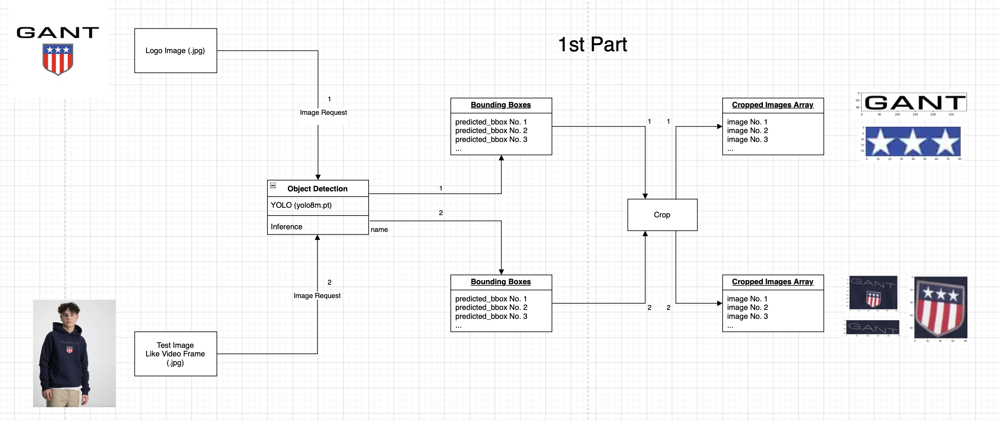
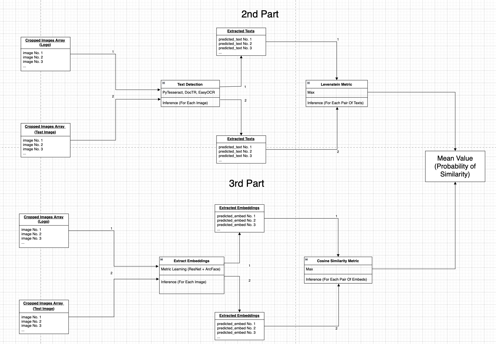
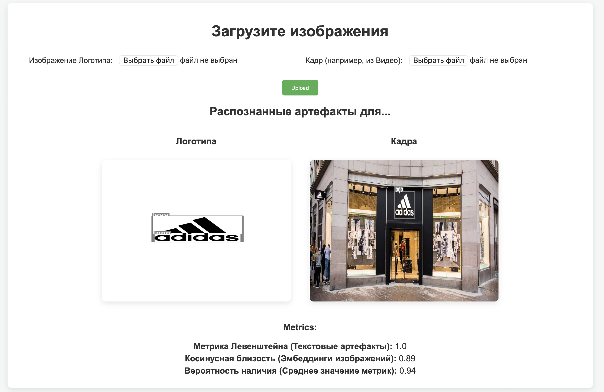
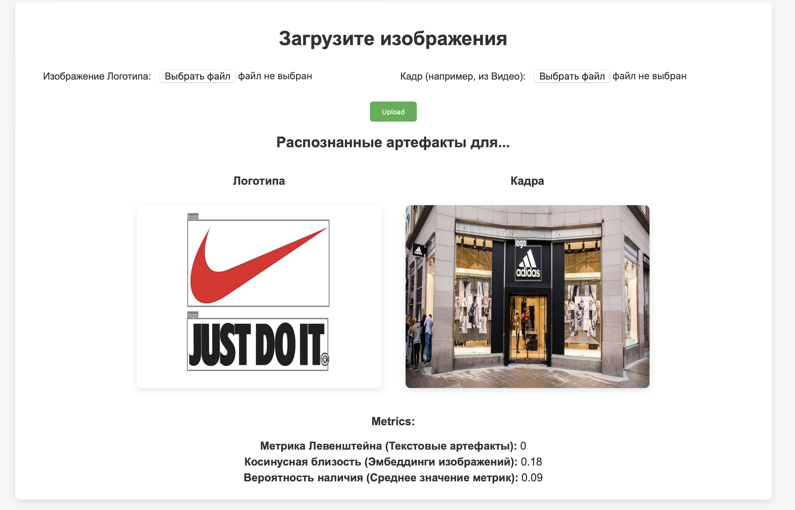

#### ```Pipeline``` задачи детекции входного логотипа на изображении

В данном репозитории реализован подход обучения и инференса моделей для решения задачи детекции логотипа на изображении.

```Задача:```

1. На вход подаётся изображение искомого логотипа.

2. На вход подаётся изображение для поиска, соответствующее, например, кадру из видео с нативной рекламой или обычной фотографии.

3. При помощи сетей детекции объектов на изображении ```(Object Detection)```, свёрточных сетей ```(для получения векторных эмбеддингов cropped объектов)``` и сетей распознавания текста на изображении ```(Optical Character Recognition)``` извлекается соответствующая информация из двух входных изображений.

4. На основе извлеченной информации вычисляются метрики косинусной близости изображений ```(Cosine Similarity)``` и разности непустых текстовых предсказаний```(Levenstein Distance).```

5. Полученные метрики аггрегируются ```(mean)```, искомое число интерпетируется, как вероятность наличия логотипа на изображении ```(Prob. of existance).```

```Пример:```

1. Подается фото логотипа ```adidas.```

2. Подается фото ```магазина adidas.```

3. Выделяются ```объекты на обоих изображениях```, исходные изображения превращаются в ```массивы cropped изображений,``` соответствующих объектам.

4. Выделяются ```распознанные тексты по элементам массивов изображений.```

5. Выделяются ```эмбеддинги по элементам массивов изображений.```

6. Считаются максимальные метрики ```близости по тексту и эмбеддингам.```

7. Вычисляется ```среднее двух метрик.``` Если полученное число ```близко к 1```, то считается, что ```логотип присутствует на тестовом изображении.```


#### ```Архитектура``` сервиса

Архитектура разработанного проекта представлена на схемах ```(часть 1 + объединные части 2 и 3).```



 
```Рисунок 1``` - Первая часть архитектуры


Первая часть архитектуры ```(рис. 1)``` предсказывает при помощи настроенной модели детекции логотипов и их составных частей ```(YOLO fine-tuned)``` предсказывает рамки ```(bounding boxes).``` Далее получается массив изображений, соответствующих обрезке ```(crop)``` исходных изоюражений по ```bounding box'ам.```

```Пример:```

Логотип одежды и человек в худи подаются на вход. ```YOLO``` детектирует рамки и обрезает изображения. На выходе получаются составные части.



```Рисунок 2``` - Финальная часть архитектуры

Вторая часть архитектуры ```(рис. 2).``` работает с полученными массивами изображений. Первая ветвь позволяет получить предсказания текстов на изображениях с помощью инференса сетей ```PyTesseract, DocTR (Roboflow API) и Easyocr.``` После происходит подсчет метрики на основе ```расстояния Левенштейна (берется максимальное значение из всех пар получившихся предсказаний).``` Вторая ветвь даёт возможность получить ```пары эмбеддингов изображений на основе модели ResNet, предварительно обученной на задаче Metric Learning.``` Вычисляется ```максимальная косинусная мера близости``` по всем парам эмбеддингов. Полученные метрики аггрегируются средним и результат интерпретируется, как вероятность наличия логотипа на изображении ($ prob \in [0; 1]$).

Для отображения в лучшем качестве открыть в формате [drawio](./notebooks/figures/drawio/project_architecture.drawio.html).

#### ```Пример работы сервиса```

Веб-интерфейс приложения представлени на ```рисунках 3 и 4.```




```Рисунок 3``` - Пример наличия логотипа



```Рисунок 4``` - Пример отсутствия логотипа

#### Запуск через ```docker```

1. Установите Docker на ваш компьютер.
2. Выполните команду для загрузки образа:

    ```sh
    docker pull 4ervonec19/vk_video_intern
    ```

3. Запустите контейнер:

    ```sh
    docker run -d -p 8002:8002 --name vk_video_intern_container 4ervonec19/vk_video_intern
    ```

4. Откройте браузер и перейдите по адресу `http://localhost:8002`, чтобы увидеть работающий проект. Или используйте ```docker logs <HASH>.```

#### Структура проекта

```bash
├── Dockerfile
├── README.md # Описание проекта
├── notebooks # Python ноутбуки с исследованием моделей и данных LogDet-3K
│   ├── data_exploration.ipynb
│   ├── data_preparation.ipynb
│   ├── data_preparation_and_full_learning.ipynb
│   ├── data_preparation_and_metric_learning.ipynb
│   ├── data_preparation_and_yolo_learning.ipynb
│   ├── metric_learning_arcface_testing.ipynb
│   ├── product_inference.ipynb
│   ├── text_recognition_testing.ipynb
│   ├── figures # Экземпляры изображений для инференса
│   │   ├── drawio # .drawio схема-диаграмма проекта
│   │   │   ├── project_architecture.drawio
│   │   │   ├── project_architecture.drawio.html
│   │   │   ├── project_architecture.drawio.png
│   │   │   ├── project_architecture.drawio.svg
│   │   │   ├── project_architecture_part1.png
│   │   │   └── project_architecture_part2.png
│   │   ├── examples # Примеры работы веб-интерфейса
│   │   │   ├── adidas_vs_adidas.png
│   │   │   └── nike_vs_adidas.png
│   │   ├── task # Техническое задание
│   │   │   └── task_vk_video_intern.png
│   │   ├── adidas_classic_logo.jpg
│   │   ├── adidas_classic_shop.jpg
│   │   ├── adidas_originals.jpg
│   │   ├── adidas_shop.jpg
│   │   ├── gant.png
│   │   ├── gant_logo.jpg
│   │   ├── nike.jpg
│   │   └── vk.jpg
│   ├── metric_learning # Полученные данные обучения ResNet на задаче Metric Learning
│   │   ├── arcface_weights # Сохранённые веса (Отсутствуют на GitHub ввиду лимита размера файлов)
│   │   │   ├── best-checkpoint-arcfaceloss-epoch=14-validation_loss=0.09.ckpt
│   │   │   └── best-precision-arcfaceloss-epoch=14-precision_at_1_epoch=0.95.ckpt
│   │   ├── labels # Словарь меток
│   │   │   └── idx2classname.json
│   │   └── logs # Логи (TensorBoard)
│   │       ├── events.out.tfevents.1738448381.52ba110f897e.18.0
│   │       └── hparams.yaml
│   └── yolo # Полученные дынные обучения YOLO
│       ├── yolo_val_prediction # Примеры предсказаний
│       │   ├── val_batch0_pred.jpg
│       │   ├── val_batch2_labels.jpg
│       │   └── val_batch2_pred.jpg
│       └── yolo_weigths # Сохранённые веса (Отсутствуют на GitHub ввиду лимита размера файлов)
│           └── best.pt
├── project # Реализация проекта
│   ├── app.py # Реализация приложения
│   ├── inference_embeddings.py # Вспомогательная логика (реализация инференса)
│   ├── inference_text_detection.py # Вспомогательная логика (реализация инференса)
│   ├── frames # Сохраненные Input'ы кадров
│   │   ├── initial_5_frame.jpg
│   │   └── initial_7_frame.jpg
│   ├── logos # Сохраненные Input'ы логотипов
│   │   ├── initial_5_logo.jpg
│   │   └── initial_7_logo.jpg
│   ├── processed_frames # Сохраненные Output'ы кадров
│   │   ├── processed_5_frame.jpg
│   │   └── processed_7_frame.jpg
│   ├── processed_logos # Сохраненные Output'ы логотипов
│   │   ├── processed_5_logo.jpg
│   │   └── processed_7_logo.jpg
│   └── templates # Frontend
│       └── upload.html
├── references # Ссылки на датасет
│   └── README.md
└── requirements.txt
```


